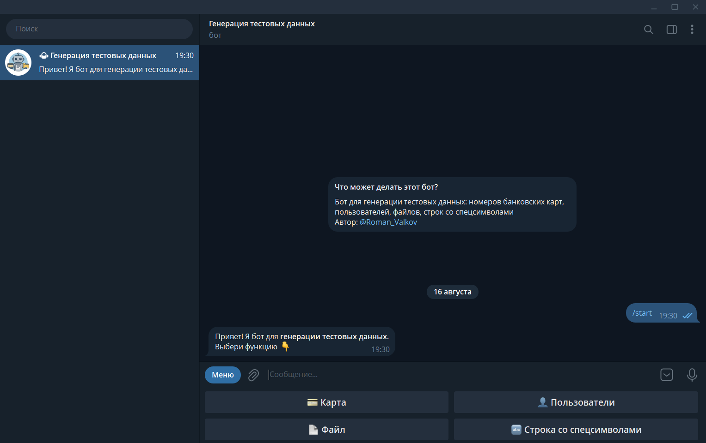
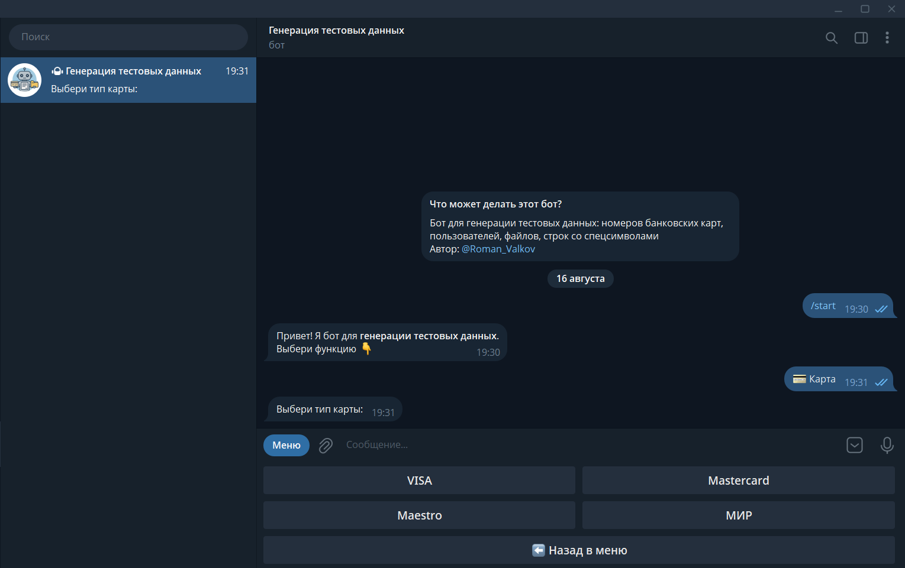
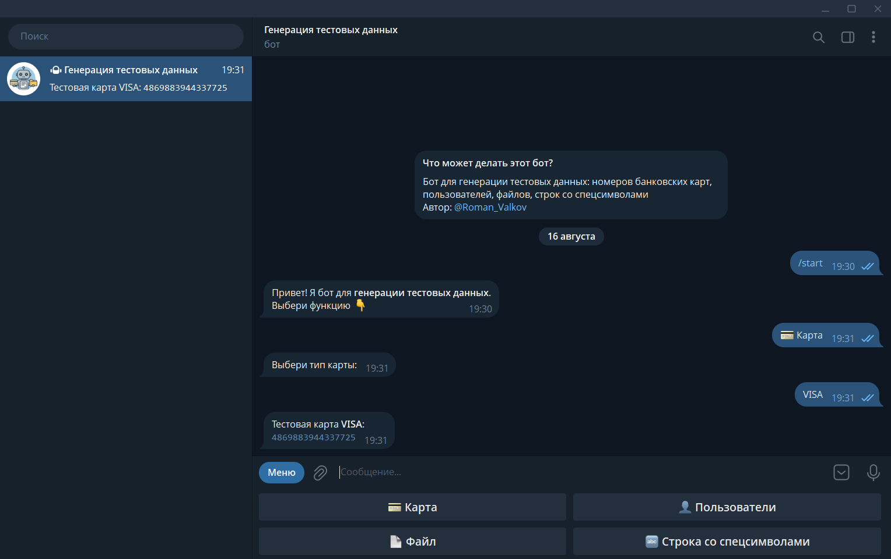
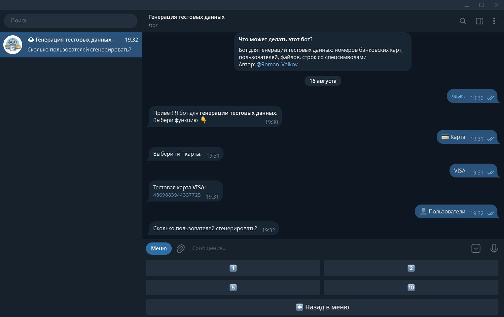
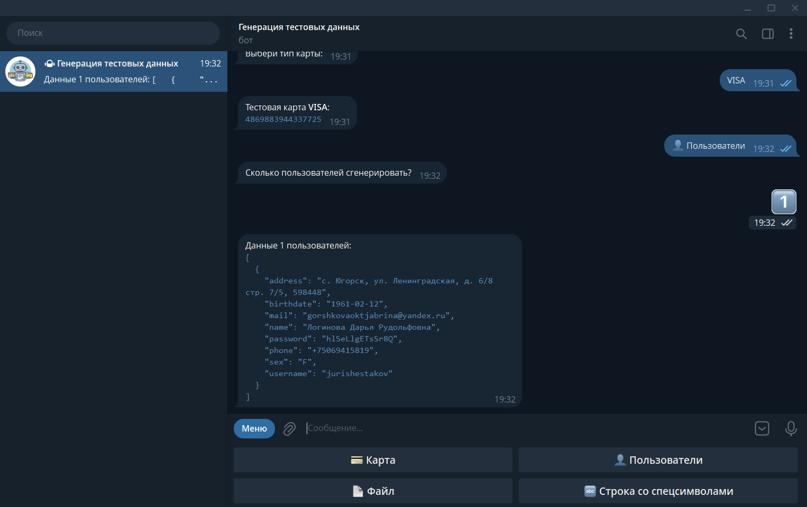
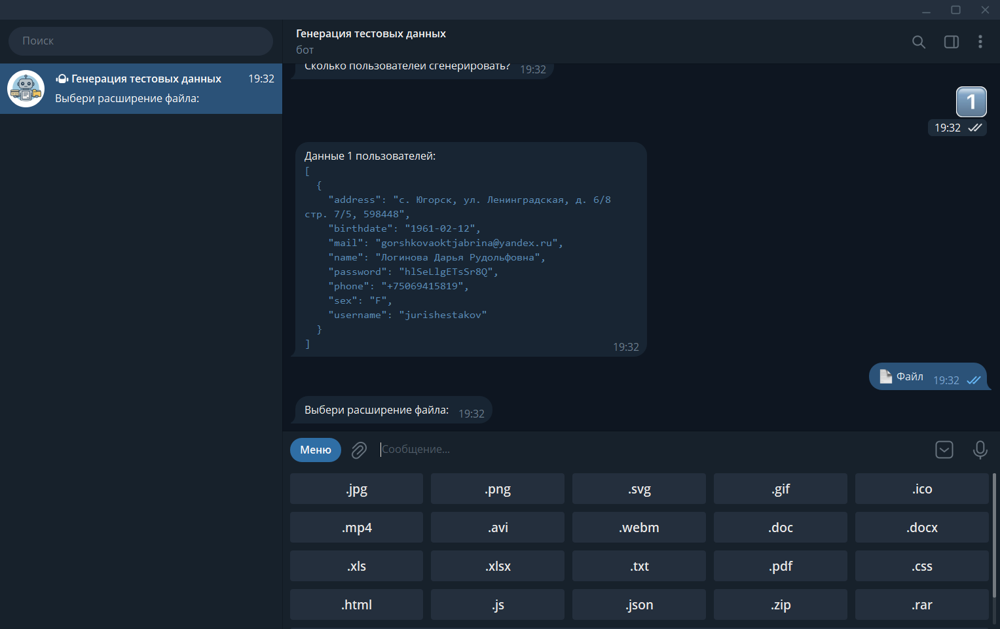
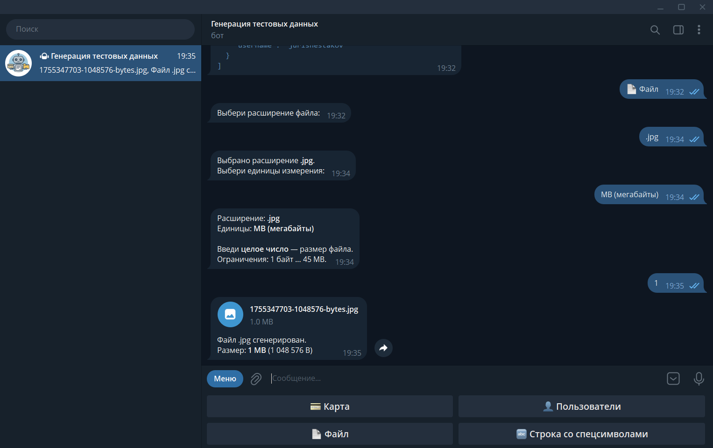
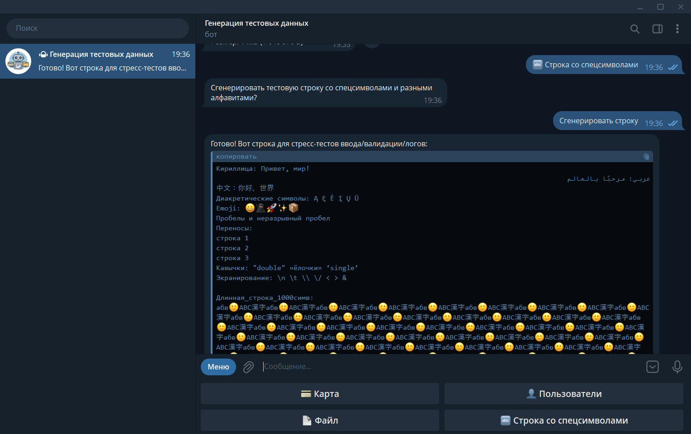

<h2>Telegram-бот для генерации тестовых данных</h2>

**Статус проекта:**
> https://t.me/qa_testdata_bot
> 
> 🟢 Поддерживается (активный) 

## Цели и задачи
Помочь QA-инженеру быстро получить данные для тестирования.

Бот геренирует следующие данные:
1) Номера тестовых банковских карт:
    * Номера карт проходят проверку на алгоритм Луна
    * Можно получить номер карты: Visa, Maestro, Mastercard, МИР
2) Тестовые пользователи
    * Бот принимает на входе число N, а на выходе создаёт N пользователей со случайно заполненными полями: имя, почта, адрес, логин, пароль, дата рождения, телефон, пол
3) Тестовый файл
    * Бот принимает на входе тип и размер файла, а на выходе отдаёт сам файл.
    * Это может пригодиться, когда на сайте есть ограничение на размер загрузки файла и нужно проверить граничные значения.
4) Строка со спецсимволами и разными алфавитами
    * Бот отправляет строку с несколькими спецсимволами и алфавитами для тестирования полей ввода и валидации

## 🖼 Скриншоты

Стартовое меню:

Выбор карты:

Вывод номера карты:

Выбор количества пользователей:

Вывод данных пользователей:

Выбор расширения файла:

Вывод файла:

Вывод строки со спецсимволами:

## 💻 Технологии

* Python
* Библиотека `telebot`
* Библиотека `faker`
